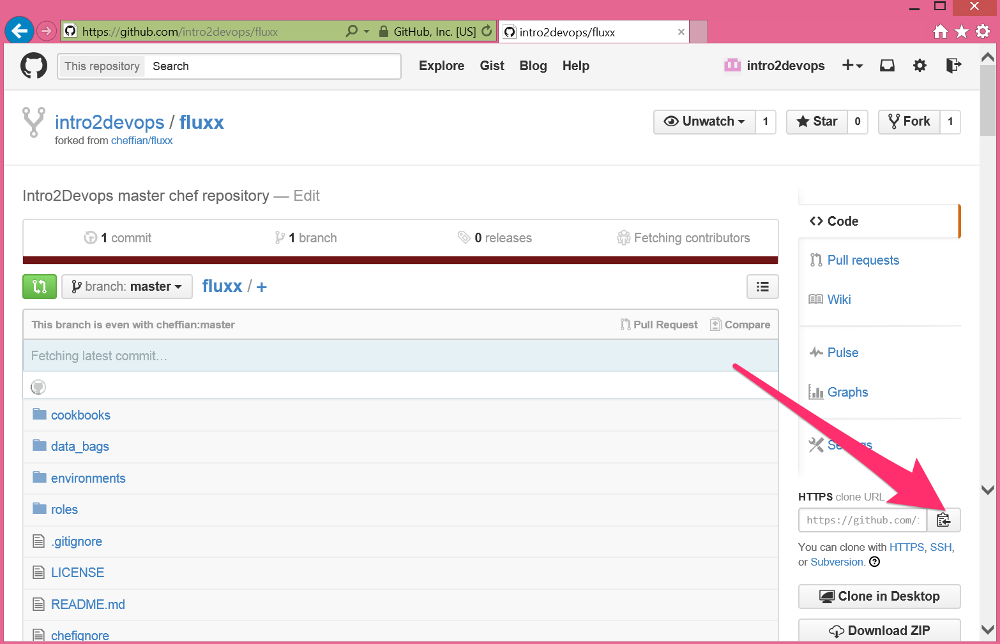
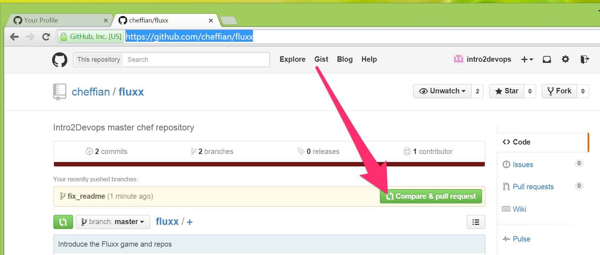
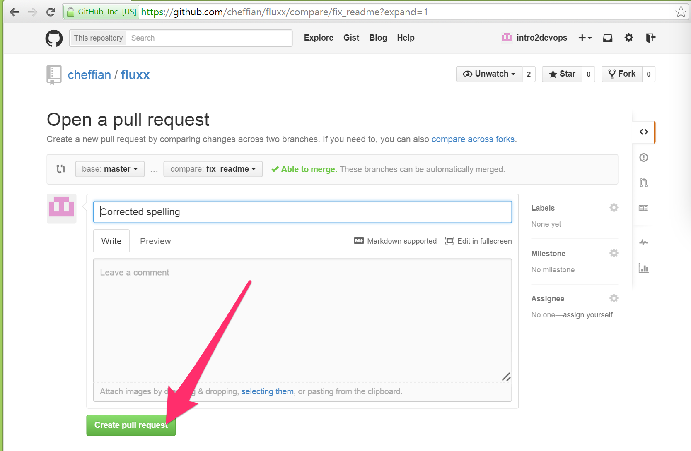
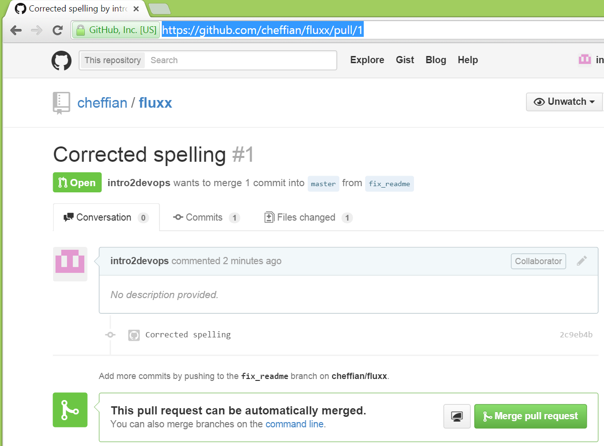
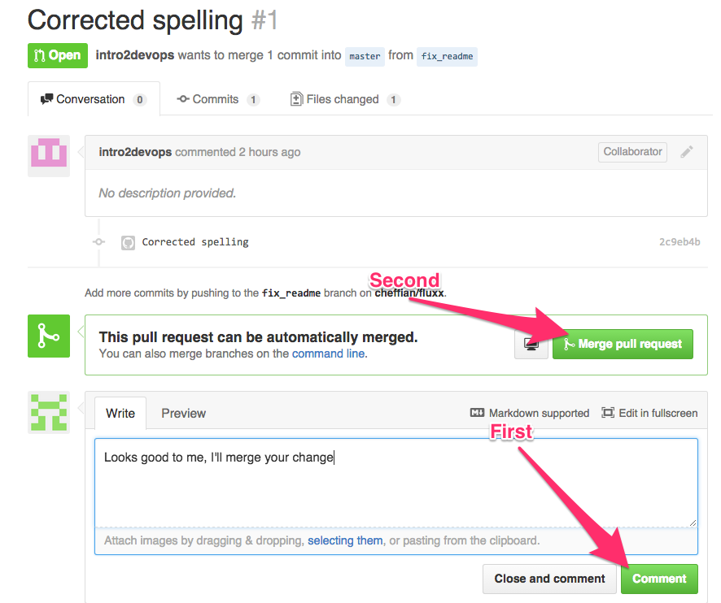

# Lab 3


## Practice GitHub (GH) Workflow

A. _Clone_ your common GH repository for local dev
B. Correct documentation and submit _Pull Request_ (PR)
C. Collaborate to approve and _merge_ the change
D. Clean up


----

### Personalizing the lab

- Where `<fluxx>` appears, use your Fluxx group name.
  - For example: `ws.milk.devopsdc.com` if 'milk' is your group
- Where (your password) appears, then supply the password
  - Your instructor should have provided this
- Where `<user>` appears, use either `alpha` or `bravo` per your team role.
- Where `<gh_user>`, substitute your personal GH account name

----

### Collaboration

- Work in a pair on the same <fluxx> repo
- One of you will use her/his GitHub account to create the PR in B.
  - You'll be partner A (or alpha)
- The other will use her/his GitHub account to approve it in C.
  - You'll be partner B (or bravo)


---

## A. _Clone_ your common GH repository for local dev

----

### Customize your workstation's Git configuration

- Run the following, with personalization:

```
git config --global user.name "Alpha DevOp"
git config --global user.email "alpha@example.com"
```

----

### Find your project repository (repo)

- Login to GitHub at
- Navigate to https://github.com/cheffian/<fluxx>
- Copy the `HTTPS clone URL`



----

- Then `clone` onto your _workstation_

```bash
cd  # change back to home directory
git clone https://github.com/cheffian/fluxx.git
```

- And confirm you have the correct Git _remote_

```bash
cd <fluxx>
git remote -v
```
```
origin  https://github.com/cheffian/fluxx.git (fetch)
origin  https://github.com/cheffian/fluxx.git (push)
```

----

# Fini 3.A

We've demonstrated:
- Customizing the workstation Git configuration
- Making a _clone_ of a GitHub repo on the workstation

---

## B. Correct the documentation and submit a _pull request_

----

The `README.md` has an ugly typo, 'awsaume'. Let's fix it:

- _branch_ the repo to keep our work separate
- fix the typo in `nano` and save
- _commit_ the change with a _commit message_
- _push_ the change to _upstream_ GitHub repo
- submit a _pull request_ to the _upstream_ Cheffian repo

----

### Branch the repo

```command-line
git branch fix_readme
git checkout fix_readme
```
```output
Switched to branch 'fix_readme'
```

----

### Fix and commit

- Edit the `README.md` with `nano` (or your fav editor)
  - Fix the typo, save the file
- Then on the command line

```bash
git status              # see that
git add README.md       # 'stage' the change
git commit -m "message" # use your own 'message'
```

----

### Sample commands and output

```
$ git status
On branch fix_readme
Changes not staged for commit:
  (use "git add <file>..." to update what will be committed)
  (use "git checkout -- <file>..." to discard changes in working directory)

        modified:   README.md

no changes added to commit (use "git add" and/or "git commit -a")
```
```
git add README.md
git commit -m "Corrected message"
```

----

### Push your fixed branch _upstream_

- Note that you're _pushing_ to the _origin_ _branch_ named `fix_readme`
  - This branch will be created if it doesn't exist upstream

```
git push origin fix_readme
```

----

### Sample command and output

```
$ git push origin fix_readme
Username for 'https://github.com': intro2devops
Password for 'https://intro2devops@github.com':
Counting objects: 5, done.
Compressing objects: 100% (3/3), done.
Writing objects: 100% (3/3), 294 bytes | 0 bytes/s, done.
Total 3 (delta 2), reused 0 (delta 0)
To https://github.com/cheffian/fluxx.git
 * [new branch]      fix_readme -> fix_readme
```

----

### Use Website to submit _Pull Request_

- Navigate to https://github.com/cheffian/<fluxx>
  - and select `Compare and pull request`



----

- In the 'Open a pull request' screen, preview your changes, update info, then click, `Create pull request`



----

You should then see this:



----

## Fini 3.B

Accomplished:

- You now have code correction
- In the form of a PR
- Ready for your colleague to review

---

## 3.C Collaborate to review and merge the change

----

### Review, approve, and merge

Partner B:
- In your browser, go to
  - https://github.com/cheffian/<fluxx>/pull/1
- Leave a comment, e.g.:
  - `Looks good to me. I'll merge your change`
- Then click 'Merge pull request'
  - The accept the 'Delete branch' option


----

### Example GitHub PR/Merge



<!-- also lab3_gh_delete_branch if we want to be verbose -->

----

## Fini 3.C

Accomplished:

- You're reviewed partner's code
  - and merged the change in the master branch
- This is "Continuous Integration"
  - only without the tests

---

## 3.D Cleanup

----

Alpha goes back onto master, gets master updated:

```
git status              # should be on branch 'fix_readme'
git checkout master
git status              # now on branch 'master'
git pull origin master  # Get upstream changes
```

----

Make sure we have the change:

```
more README.md
```

Clean up the _feature branch_

```
git branch -d fix_readme
```

You'd be warned if deleting a branch with un-merged changes.

----

## Fini 3.D

Discussion questions
