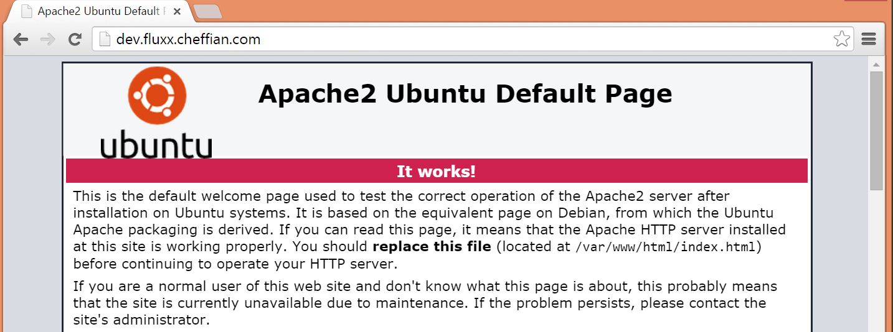
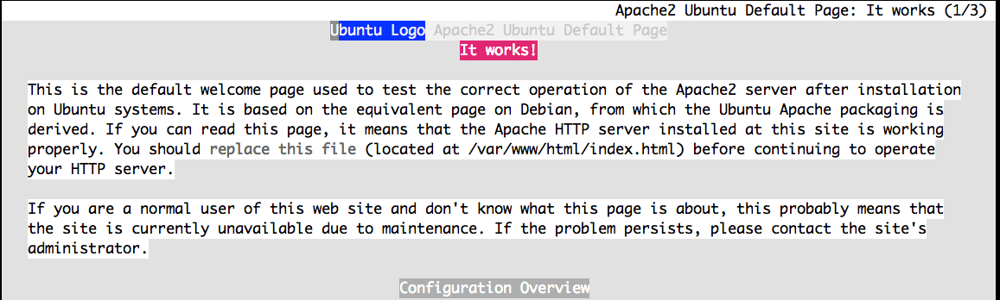
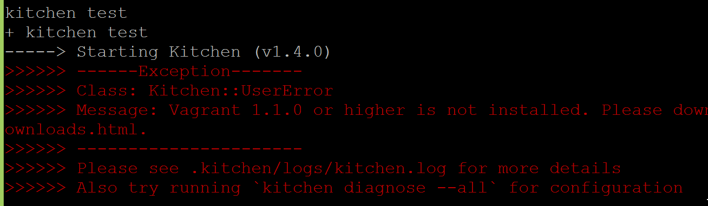

# Lab 4

## Test Locally

----

Note. So you have this repo cloned onto your workstation, what does it do?

Note. It's the repo that configures your workstation, your dev node, your ci node and all the other bits for running this workshop.  We'll use this cookbook to make www.devopsdc.com real.


A. View http://dev.<fluxx>.cheffian.com, determine what to change<br>
  - It should have content relevant to a Devops introduction.
B. Confirm current test suite
C. Update the tests, then code to pass the test
D. Commit and submit PR

----

### View from Chrome

http://dev.<fluxx>.cheffian.com


----

### View from 'elinks'

```
elinks http://dev.<fluxx>.cheffian.com
```


----

### Let's look at the code in charge

```
cd ~/<fluxx>/cookbooks/i2d_web
tree .
```
```
b$ tree .
.
├── Berksfile
├── chefignore
├── metadata.rb
├── README.md
├── recipes
│   ├── core.rb
│   └── default.rb
├── run_tests.sh
├── spec
│   ├── spec_helper.rb
│   └── unit
│       └── recipes
│           └── core_spec.rb
└── test
    └── integration
        ├── core
        │   └── serverspec
        │       └── core_spec.rb
        └── helpers
            └── serverspec
                └── spec_helper.rb
```

----

### What with these tests?

```bash
# more run_tests.sh
foodcritic -f any .
rspec
kitchen test
```

----

### Do all them currently pass?

```
./run_tests
```

- Hums along until:




----

Note: Let's get Docker running


```
docker start
```

----

### We can fix this

1. Confirm our tests work as thing stand now
1. Create a feature branch
1. Write a _failing_ test, then
  1. Write the correcting code
  1. Retest, if failure, try again, else
1. Commit and submit PR

----
